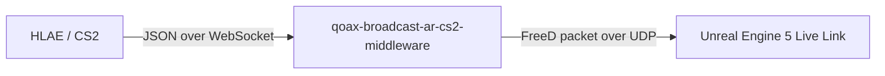

# qoax-broadcast-ar-cs2-middleware

Middleware that receives CS2 HLAE camera data over WebSocket, converts it into a
[FreeD](https://dev.epicgames.com/documentation/unreal-engine/live-link-freed--in-unreal-engine)
UDP packet, and forwards it to Unreal Engine 5's Live Link so a virtual/AR camera can follow the
in-game spectator camera in real time.

## How it works



1. HLAE connects to the local WebSocket server and streams camera data (`yaw`, `pitch`, `roll`,
   `x`, `y`, `z`, `fov`) as JSON messages.
2. The middleware validates and converts each message into a 29-byte FreeD packet.
3. The packet is sent over UDP to the configured Unreal Engine endpoint.

## Requirements

- Node.js 18+
- npm

## Install

```bash
npm install
```

## Build

```bash
npm run build
```

Compiles TypeScript from `src/` to `dist/`.

## Run

```bash
npm run start
```

Or run the compiled entry point directly:

```bash
node dist/index.js
```

For active development, `npm run dev` runs the TypeScript compiler in watch mode.

## Test

```bash
npm test
```

Builds the project and runs the unit tests (Node's built-in test runner) against the compiled
`dist/index.test.js`.

## CLI configuration

The middleware is a CLI tool and accepts flags to configure both endpoints. All flags are
optional; localhost defaults are used when a flag is omitted.

| Flag | Description | Default |
| --- | --- | --- |
| `--unreal-address <host:port>` | Combined Unreal Engine host and port | `127.0.0.1:40000` |
| `--unreal-host <host>` | Unreal Engine target host | `127.0.0.1` |
| `--unreal-port <port>` | Unreal Engine target UDP port | `40000` |
| `--websocket-address <host:port>` | Combined WebSocket bind host and port | `127.0.0.1:3000` |
| `--websocket-host <host>` | WebSocket server bind host | `127.0.0.1` |
| `--websocket-port <port>` | WebSocket server port | `3000` |
| `--help`, `-h` | Print usage information | |

Combined `--*-address` flags accept either `host:port` or a full URL such as
`ws://127.0.0.1:3000`. Individual `--*-host` / `--*-port` flags take precedence over the parsed
address when both are provided.

### Examples

Use defaults (everything on localhost):

```bash
node dist/index.js
```

Point to a specific Unreal Engine machine on the network:

```bash
node dist/index.js --unreal-address 192.168.3.177:40000
```

Expose the WebSocket listener on all network interfaces (e.g. HLAE runs on another machine):

```bash
node dist/index.js --websocket-host 0.0.0.0
```

### Notes on `websocket-host`

`websocket-host` controls which network interface the WebSocket server binds/listens on, not
where data is sent to:

- `127.0.0.1` (default) — only accepts connections from the same machine. Use this when HLAE and
  this middleware run on the same PC, which is the common case.
- `0.0.0.0` — accepts connections from any interface. Use this if HLAE runs on a different
  machine on the network.
- A specific LAN IP — restricts listening to just that network interface.

If HLAE always runs on the same machine as this middleware, you can safely ignore this flag and
rely on the default.

## HLAE integration script

[hlae/cam-export.js](hlae/cam-export.js) is the HLAE mirv-script that runs inside CS2/HLAE itself.
It hooks the engine's view render loop, reads the live spectator camera (position, angles, FOV),
and streams it as JSON to this middleware's WebSocket server. It connects to `ws://127.0.0.1:3000`
by default (matching this project's default `websocket-host`/`websocket-port`) and retries the
connection every 2 seconds if it's dropped or was never established.

HLAE loads scripts from its own installation folder, not from this repository, so the script
needs to be placed at:

```
%ProgramFiles(x86)%\HLAE\resources\AfxHookSource2\snippets\cam-export.js
```

### Linking the script into HLAE

Run the helper script from a PowerShell prompt to link the version-controlled copy into your HLAE
installation:

```powershell
./scripts/link-hlae-snippet.ps1
```

This creates a symbolic link so future edits to `hlae/cam-export.js` are picked up by HLAE
automatically. Creating a file symlink on Windows normally requires either an Administrator
PowerShell session or Developer Mode enabled (Settings > Update & Security > For developers). If
neither is available, the script falls back to copying the file instead — in that case, re-run it
after making changes to keep HLAE's copy in sync.

If HLAE is installed somewhere other than the default `Program Files (x86)\HLAE`, pass its path
explicitly:

```powershell
./scripts/link-hlae-snippet.ps1 -HlaePath "D:\Tools\HLAE"
```

## Releases

Pushing a tag matching `v*.*.*` (e.g. `v0.1.0`) triggers [.github/workflows/release.yml](.github/workflows/release.yml),
which builds standalone executables — no local Node.js install required to run them — for:

- Windows (`qoax-broadcast-ar-cs2-middleware-win.exe`)
- macOS (`qoax-broadcast-ar-cs2-middleware-macos`)
- Linux (`qoax-broadcast-ar-cs2-middleware-linux`)

and publishes them as a GitHub release alongside [hlae/cam-export.js](hlae/cam-export.js). Each
executable accepts the same CLI flags described above (e.g.
`./qoax-broadcast-ar-cs2-middleware-linux --unreal-address 192.168.3.177:40000`).

To build the executables locally:

```bash
npm run package
```

This builds the TypeScript project and uses [`@yao-pkg/pkg`](https://github.com/yao-pkg/pkg) to
produce the three binaries in `release/`.

## Project structure

```
.github/
  workflows/
    release.yml   Builds and publishes standalone executables on tag push
src/
  index.ts        CLI entry point: parses flags and starts the bridge
  config.ts       CLI argument parsing and default configuration
  server.ts       WebSocket + UDP bridge runtime
  packet.ts       HLAE payload validation and FreeD packet packing
  types.ts        Shared TypeScript types
  index.test.ts   Unit tests
hlae/
  cam-export.js   HLAE mirv-script that streams camera data to the bridge
scripts/
  link-hlae-snippet.ps1   Links hlae/cam-export.js into the HLAE installation
```

## FreeD packet format

Each packet is 29 bytes:

| Bytes | Field |
| --- | --- |
| 0 | Message type (`0xD1`) |
| 1 | Camera ID (`0xFF`) |
| 2-4 | Yaw |
| 5-7 | Pitch (inverted) |
| 8-10 | Roll |
| 11-13 | Y position (converted from inches to cm) |
| 14-16 | X position (converted from inches to cm) |
| 17-19 | Z position (converted from inches to cm) |
| 20-22 | Reserved (zoom, unused) |
| 23-25 | FOV |
| 26-27 | Reserved |
| 28 | Checksum |